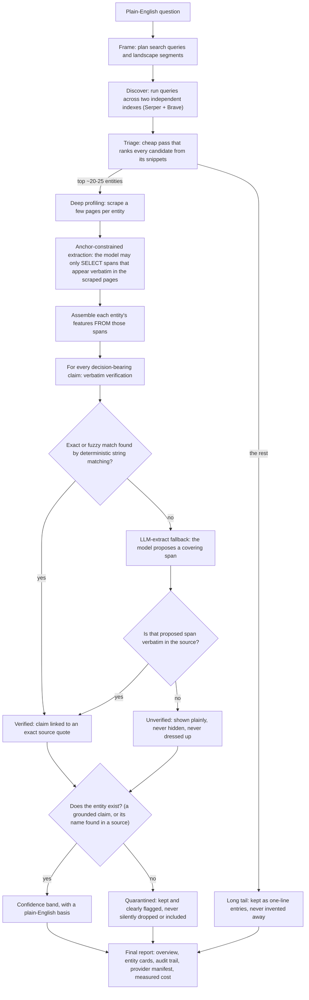
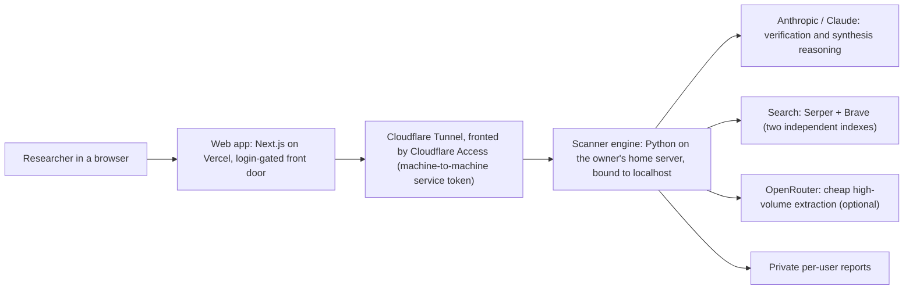

# How the Landscape Scanner works

The Landscape Scanner turns a plain-English question — *"entrepreneurship programmes, current and past, in Kenya"* — into a landscape report you can trust: an executive overview, entity cards with key features, and a full audit trail where every claim traces back to an exact quote in a real source. It is built to be honest about what it does and doesn't know: facts can only come from sources it actually read, uncertainty is shown rather than smoothed over, and every report states exactly which search engines and models produced it. This document explains the steps it takes to aim for reliable, verifiable results.

## Diagram A — the reliability pipeline

The scanner runs as a funnel that stays cheap and focused, followed by a verification stage that is the heart of the design. The path that matters most is what happens to each individual claim: it is grounded to an exact quote, or it is shown as unverified — never quietly accepted.

## What each step does, in plain English

**The funnel — broad, then narrow, to stay cheap and focused.**

1. **Frame.** One cheap planning call turns your question into a set of search queries and a first-draft way to carve up the landscape into segments.
2. **Discover broadly.** Every query is run across two **independent** search indexes — Serper (a Google-backed search API) and Brave — so a second engine can corroborate, or surface, what the first one finds. That second index is what makes the cross-index agreement signal in the confidence step (8) possible. (Brave is optional in the engine, but this deployment runs both.) It then pulls candidate entity names out of the results — and even at this early stage it can only pick out names that actually appear in the result text, not names the model "remembers."
3. **Cheap triage.** All candidates are ranked from their search snippets in a few batched, inexpensive passes. The strongest ~20–25 go forward for deep profiling; clear noise is dropped, and the remaining relevant-but-not-profiled entities are kept as a **long tail** of one-line entries. They stay visible in the report so the overview never claims a category is empty when examples are sitting right there, unprofiled.
4. **Deep profiling.** For each shortlisted entity, the scanner fetches (scrapes) a few of its source pages. This is where the real money goes, which is exactly why it is capped to the shortlist.

**The reliability mechanisms — the point of the whole system.**

5. **Anchor-constrained extraction.** Before assembling a profile, the scanner builds an inventory of text spans taken from the scraped pages — and any span the model returns is *thrown away on the spot unless it is a verbatim substring of the page.* The entity's profile can then only be built by *selecting* from that anchored vocabulary. The model is never free to write what it "knows," so a fact can never be imported from the model's imagination. This is the single most important guardrail.

6. **Verbatim verification.** Every decision-bearing claim must trace to an exact quote found in a real source. The check runs cheapest-and-most-trustworthy first:
   - **Deterministic restoration (no model, costs nothing).** The claim is matched against the source text by exact string match, then by high-threshold fuzzy match. Because claims were assembled from spans that already came out of the sources, most of them ground here without a model ever being consulted.
   - **Value-only matches don't count.** If only a claim's *numbers* appear in a source but not the statement tying them to this entity, that is treated as **not** verified — it is the classic "the figure is in the page, but the page never says it about this entity" trap, and the scanner refuses to fall for it.
   - **LLM-extract, as a last resort — and always re-checked.** Only then is a model asked to point at a span that covers the claim. Whatever it returns is **re-validated to be verbatim in the source.** A span the model invented fails that check and the claim simply stays unverified. The model therefore can never launder a fabrication into a "verified" claim.
   - A claim that nothing supports is marked **unverified**, which is information, not an error. The report shows it as such rather than hiding it or presenting it as fact.

7. **Quarantine, not deletion.** An entity counts as existing only if at least one claim about it grounded to a real source span, or its name appears verbatim in a scraped page. An entity that fails this test is **quarantined** — kept in the report and clearly flagged — never silently deleted and never silently presented as confirmed. You see the engine's uncertainty instead of a suspiciously tidy list.

8. **Confidence bands with a plain-English basis.** Every entity carries a high / medium / low band whose reasoning is spelled out in words, e.g. *"existence verified; 3 of 4 key features grounded; found by 2+ independent search indexes."* The basis string *is* the audit trail.

9. **No silent fakery.** A live run **refuses to start** if a required API key (search and the Claude model) is missing — there is no fake fallback that quietly fills the gap with synthetic data. Every report carries a **provider manifest** stating exactly which search engines were live and which model handled each task. A demo run (canned fixtures) is flagged with an explicit, unmissable banner.

10. **A live budget meter.** Cost is measured from the **real token usage** each API reports, not estimated from a flat per-call guess. Your budget is a hard cap: when measured spend reaches it, the run **halts resumably** — every completed stage is already saved to disk, so raising the budget continues from exactly where it stopped. It never silently overspends. (As a bonus integrity check, if a model ever emits hidden "reasoning" tokens it shouldn't have, the meter counts their cost and raises an alarm that lands in the manifest.)

The final report is then synthesised from **verified material only** — the executive overview can't be built on claims that didn't ground.

## Diagram B — how it's hosted

The scanner is a Python engine the owner runs on their own always-on home server, reached through a thin, login-gated web front door. Only the web app can reach the engine, and the engine uses the owner's own API keys.

In words: a researcher signs in to a small web app (Next.js, hosted on Vercel) that acts purely as a **login-gated front door**. The engine itself runs on the owner's home server, bound to localhost so it is not exposed to the network directly. The only way in is a **Cloudflare Tunnel fronted by Cloudflare Access**, using a machine-to-machine **service token** that only the web app holds — so the engine answers the web app and nothing else. The engine runs on the **owner's own API keys**: Anthropic's Claude for the trust-critical verification and synthesis reasoning, two independent web-search indexes (Serper + Brave) for discovery, and optionally OpenRouter for cheap, high-volume extraction. Reports are stored privately per user.

## What it deliberately does NOT do

- **No ungrounded claims.** A statement is "verified" only when an exact quote supporting it was found in a real scraped source. The model cannot assert facts from its own training knowledge.
- **No silent substitution.** If a required key is missing it refuses to run rather than fabricate data; if a search provider fails mid-run it degrades and *records the degradation* in the report instead of pretending it had full coverage. Demo mode is always banner-flagged.
- **No hidden uncertainty.** Claims that can't be grounded are shown as unverified; entities that can't be confirmed are quarantined and flagged, not deleted or quietly waved through; confidence bands always state their basis; and the run never exceeds the budget you set.
